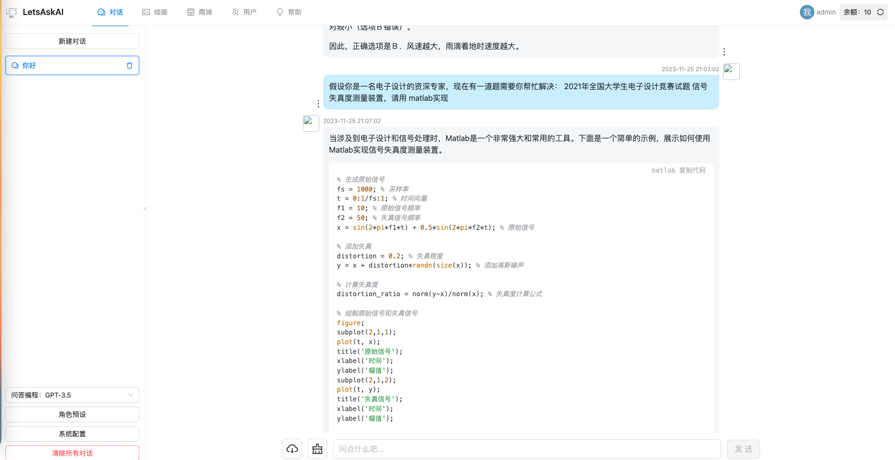
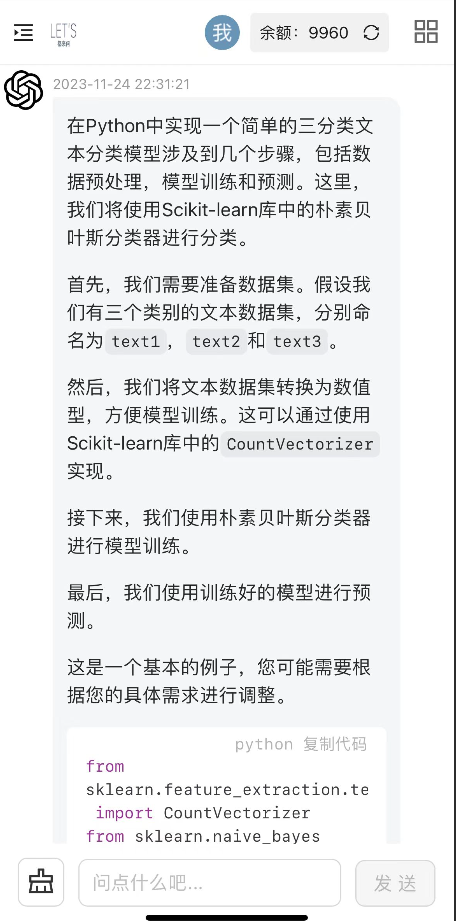
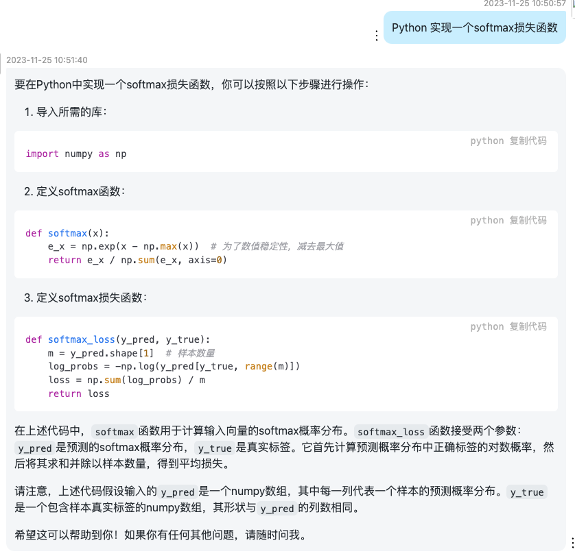
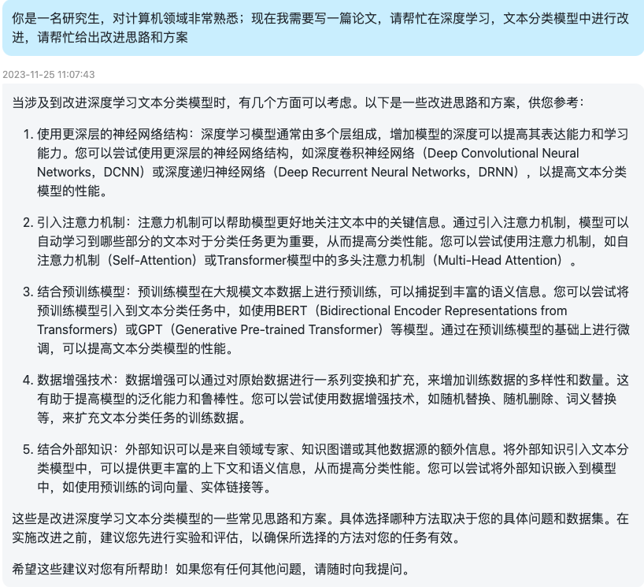
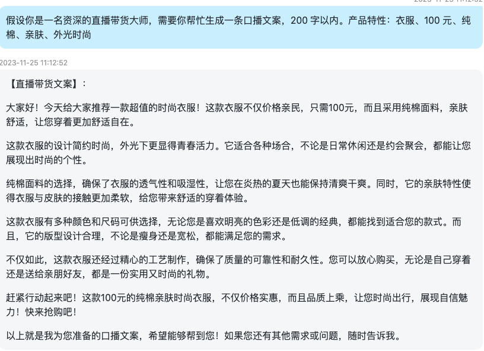
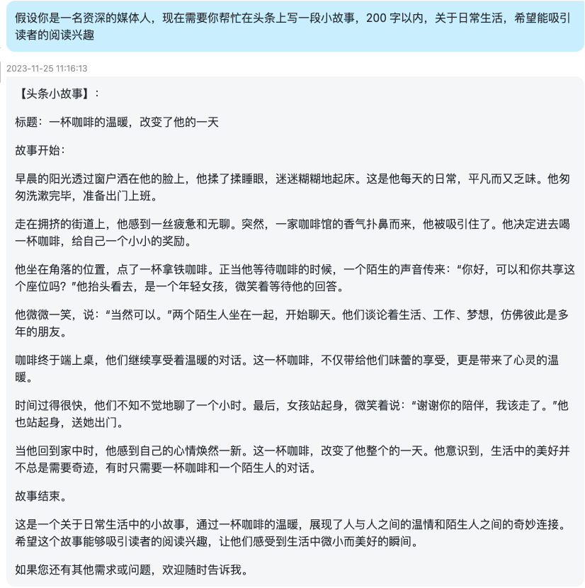
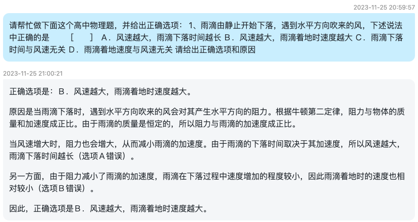
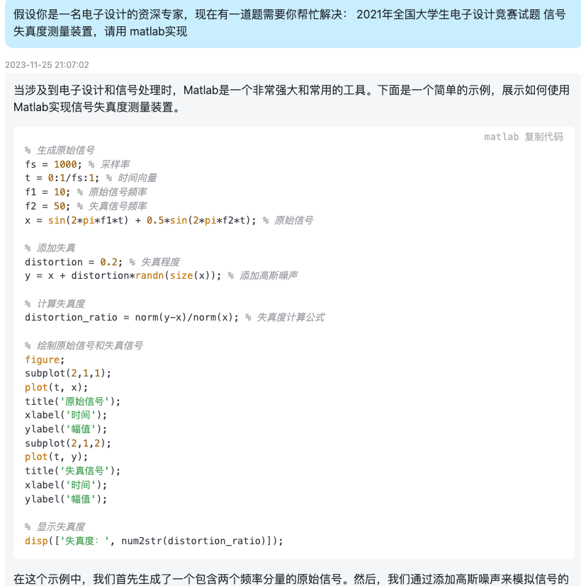

# LetsAsKAI
LetsASKAI,一个国内可以访问、使用的大语言模型平台

访问地址：http://www.aiadvice.top/

## 特性：
- 首次注册，免费尝鲜国内顺畅体验GPT3、GPT4、文心一言等AI大模型。
- Python、Java、Matlab、前端页面编码开发
- 论文改进思路
- AI 海报设计，广告文案生成
- 头条、抖音口播文案生成
- 可提供对外 API 服务

## 平台截图：

- web端：

- 移动端/H5:

## 场景截图
- 算法工程师

- 研究生（论文改进）

- 直播带货

- 头条写手

- 海报设计

- 高中物理

- matlab电子设计

## 社区
- 扫码加入社区微信交流群👇

- 🐞 请将任何 LetsAskAI  的 Bug、问题和需求提交到 群管理员。

